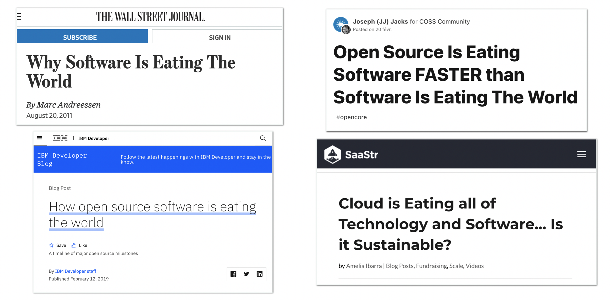
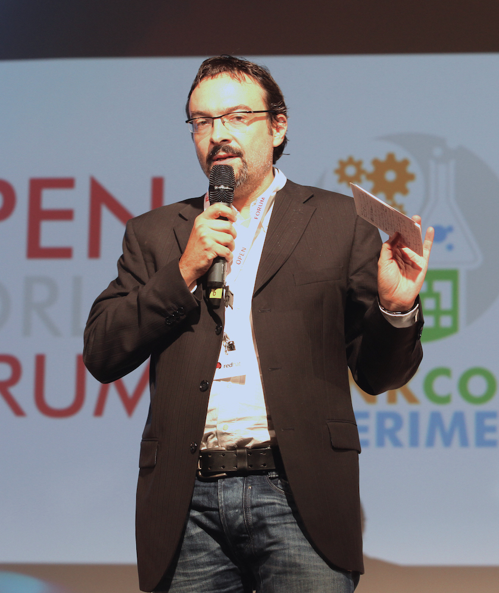
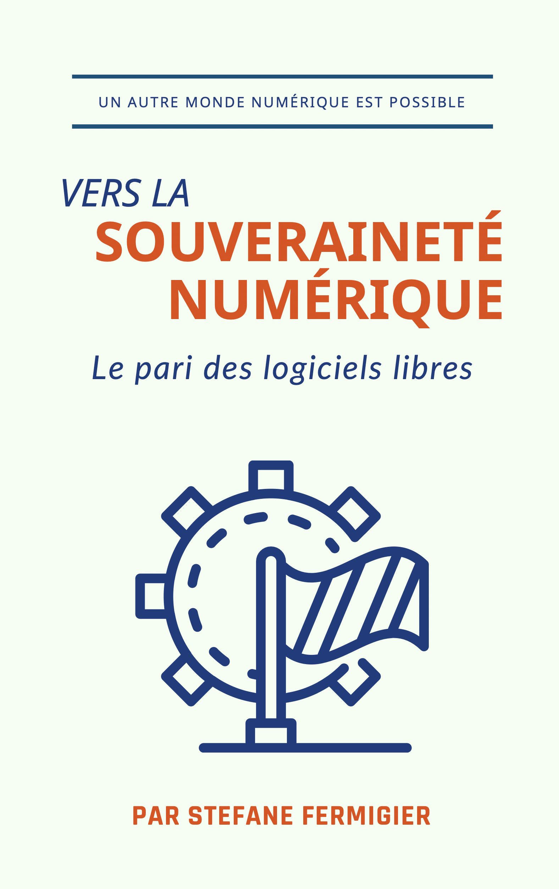

autoscale: true
slidenumbers: true

# [fit] Mineure OSS @ EPITA

Stefane Fermigier (+ intervenants)

---

# [fit] Jean-Marc Ayrault, 2012

> "Les logiciels libres sont des logiciels dont le modèle de propriété intellectuelle est conçu pour donner à l’utilisateur une grande liberté d’utilisation, de modification et de diffusion. Ils couvrent un domaine d’emploi très large, à la fois dans les entreprises privées et dans les administrations." [Circulaire interministérielle “Orientations pour l'usage des logiciels libres dans l’administration”]

---

# [fit] Axelle Lemaire, 2016

> "Les administrations [...] veillent à préserver la maîtrise, la pérennité et l’indépendance de leurs systèmes d’information. Elles encouragent l’utilisation des logiciels libres et des formats ouverts lors du développement, de l’achat ou de l’utilisation, de tout ou partie, de ces systèmes d’information." [Article 9 de la loi "pour une république numérique"]

---

# [fit] Ministère des armées, 2018

> "Une stratégie industrielle basée sur l’open source, sous réserve qu’elle s'inscrive dans une démarche commerciale réfléchie, peut permettre aux industriels français ou européens de gagner des parts de marché où ils sont aujourd’hui absents et par là même de permettre à la France et à l’Union européenne de reconquérir de la souveraineté." [Revue stratégique de cyberdéfense, 2018]

---

---

# Description

Ce cours vise à enseigner aux élèves de l’EPITA l’ingénierie, la gestion de produit et de projet, et les pratiques commerciales et organisationnelles de l’open source.

Il se composera de 12 modules de 3h (cours magistraux incluant pour certains les témoignages d’intervenants ponctuels + séance "hors les murs" à l'OSXP).

Il est à noter que ce cours est moins axé sur la technologie et plus les aspects économiques, juridiques et organisationnels de l’industrie du logiciel libre.

---

# Objectifs pédagogiques

- Comprendre le fonctionnement des projets open source
- Comprendre les aspects clés de l'industrie du logiciel
- Comprendre comment l'open source change l'industrie du logiciel
- Opérationaliser ces connaissances, afin de pouvoir les mettre en application, que ce soit dans le cadre d'une entreprise ou d'une organisation existante, ou d'une startup

---

# Planning

12 séances de 3h (le mardi de 14h à 17h)

[.column]

1\. Concepts, histoire, fondamentaux
2\. L'industrie du logiciel: les fondamentaux
3\. Aspects juridiques et éthiques
4\. Production des logiciels libres
5\. Les écosystèmes du logiciel libre
6\. Modèles économiques
7\. Participation à la conférence “Open Source Expérience” à Paris (“OSXP”)

[.column]

8\. Débrief OSXP + Modèles économiques (suite)
9\. Enjeux stratégiques et géopolitiques (intervention de Jean-Paul Smets)
10\. Inner sourcing & OSPOs (Florent Zara)
11\. Logiciels libres et politiques publiques (intervention de B. Guerry, “OSPO de l’Etat”)
12\. Soutenance des projets

---

# [fit] Intervenant principal

**Stefane Fermigier**: entrepreneur français et activiste du logiciel libre et des libertés numériques. Il est le fondateur et le PDG d'Abilian, une société qui développe des solutions de gestion de l'information d'entreprise basées sur des logiciels open source. Auparavant, il avait fondé  en 2000 Nuxeo, une société qui a été vendue en 2021 pour 150 M$. Auparavant, il a été enseignant-chercheur en mathématiques à l'Université Paris VII.
 
Il est également co-fondateur depuis 25 ans d'une demi-douzaines d'organisations dédiées à la promotion et à la défense du logiciel libre et du numérique ouvert, en France et en Europe, ainsi que de plusieurs conférences sur ces mêmes sujets.

---

# Autres intervenants

Plusieurs experts interviendront ponctuellement sur des sujets précis ou pour des retours d'expériences concrets, notamment:

- **Bastien Guerry**: chef de la “Mission logiciel libre” au sein de la DINUM (= “OSPO de l’Etat francais”)
- **Florent Zara**: directeur technique et expert Open/Inner Source de Henix, éditeur de la suite logicielle Open Source Squashtest.
- **Jean-Paul Smets**: PDG de Rapid.Space, fondateur de Nexedi et créateur du logiciel libre "ERP5" utilisé par plusieurs groupes du CAC40.
- **Ludovic Dubosc**: Entrepreneur Open Source, créateur de XWiki, fondateur et PDG de XWiki SAS, qui développe et édite les logiciels open source XWiki et CryptPad.

---

# Projet

Le projet proposé aux élèves visera à mettre en pratiques plusieurs des notions clefs abordées en cours:

- En groupe: faire correspondre des produits open source à des exigences réalistes d'une entreprise ou d'une catégorie d'entreprises
- Pour chaque étudiant du groupe: choisir un produit à analyser en profondeur
- Identifier les caractéristiques clefs de ce produit et du projet associé
- Mettre en oeuvre ce logiciel dans une plateforme de cloud (par exemple: Clever Cloud, Heroku, Nua...)
- Compléter l'évaluation "a priori" par un retour d'expérience opérationnelle
- Réaliser une "fiche produit" du logiciel retenu
- Présenter en public leur travail et leurs conclusions

---

# Bibliographie

**"Vers la souveraineté numérique: le pari des logiciels libres"**

A paraître en octobre (hopefully!)

(A droite: couverture provisoire)

---

# [fit] Bibliographie sommaire (en français)

- *Livret bleu "Fondamentaux juridiques"*. GTLL (2016). [PDF](https://cnll.fr/media/LivretBleu_Juridique-2eEdition_GT-LogicielLibre_Systematic_Nov2016_web.pdf)
- Par François Pellegrini et Sébastien Canevet, *Droit des logiciels: Logiciels privatifs et logiciels libres*. PUF (2013).
- *Etude 2021 sur la filière open source en France*. CNLL (2021). [PDF](https://cnll.fr/media/etude-cnll-2021.pdf).
- *Livret Bleu "Modèles économiques"*. GTLL (2014). [PDF](https://cnll.fr/media/LivretBleu_ModelesEconomiques_GT-LogicielLibre_Systematic.pdf).
- *The impact of Open Source software and hardware on technological independence, competitiveness and innovation in the EU economy - Résumé en français*. Commission européenne (2021). [PDF](https://cnll.fr/media/CNECT_OpenSourceStudy_FR_resume_executif.pdf).
- *Open source : une alternative aux grands fournisseurs du numérique*. Cigref (2018). [PDF](https://cnll.fr/media/Cigref-Open-source-Alternative-Grands-Fournisseurs-franchir-pas-open-source-Decembre-2018.pdf).
- Amel Charleux, *L'OPEN SOURCE ENTRE CONCURRENTS - Approche de la création et de l'appropriation de valeurs par les business models et la coopétition*. [PDF disponible ici](https://hal.archives-ouvertes.fr/tel-02523313).

---

# [fit] Bibliographie sommaire (en anglais)

- *What is free software?*. Free Software Foundation (2010). [WEB](https://www.fsf.org/about/what-is-free-software).
- Eric Raymond, *The Cathedral & the Bazaar: Musings on linux and open source by an accidental revolutionary*. O'Reilly Media, Inc (2001). [Disponible ici](http://www.catb.org/~esr/writings/cathedral-bazaar/).
- Karl Fogel, *Producing open source software: How to run a successful free software project*. O'Reilly (2020 pour la 2eme édition). [PDF disponible ici](http://producingoss.com/).
- Jono Bacon, *The Art of Community, 2nd ed.*. O'Reilly (2012). [PDF disponible ici](https://www.jonobacon.com/books/artofcommunity/).
- Shane Curcuru, *The Apache Way*. [WEB](http://theapacheway.com/).
- *The OSPO – A New Tool for Digital Government*. Open Forum Europe / OSPO Zone (2022). [PDF disponible ici](https://openforumeurope.org/publications/the-ospo-a-new-tool-for-digital-government/).
- Nadia Eghbal, *Roads & Bridges: The Unseen Labor Behind Our Digital Infrastructure*. Ford Foundation. [PDF disponible ici](https://www.fordfoundation.org/work/learning/research-reports/roads-and-bridges-the-unseen-labor-behind-our-digital-infrastructure/).
- Andrew J. Hall, *Open-Source Business Models: Making money by giving it away*. Santa Clara High Technology Law Journal (2017). [PDF disponible ici](https://digitalcommons.law.scu.edu/chtlj/vol33/iss3/3/).
