autoscale: true
slidenumbers: true
build-lists: true
slide-transition: true

# Mineure OSS @ EPITA
## Session 2

---

# Plan de la session

- Un peu d'histoire (suite):
  - Unix et sa "philosophie"
  - Emergence du libre et de Linux
- La définition de l'open source

---

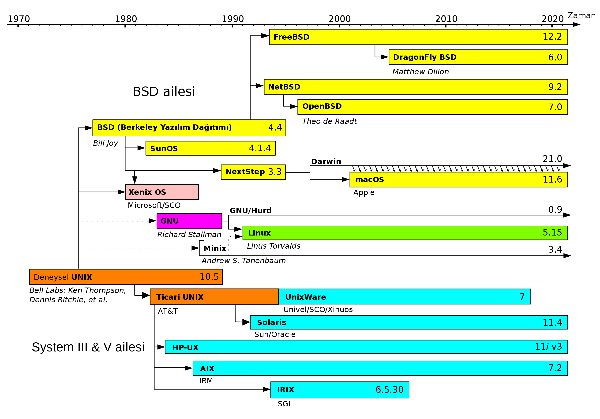

---

# Le marché Unix ~1990

[.column]
**Constructeurs**

- Sun - puces 680xx puis SPARC / SunOS (basé sur BSD) puis Solaris
- DEC - puces VAX puis Alpha / Ultrix puis Tru64
- IBM - puces PowerPC / A/IX
- SGI - puces MIPS / IRIX
- HP - puces PA-RISC / HP-UX
- Next - puces 680xx puis x86 + NextSTEP (surcouche de BSD)

[.column]
**Editeurs**

- SCO - éditeur (-> PC "standard")
- Apple - A/UX
- Microsoft - XENIX
- Autres (Atari, Amiga, Novell...)

---

# Guerre des Unix

- AT&T tente d'imposer sa variante (System V) comme le standard, et s'allie avec Sun pour intégrer TCP/IP (en provenance de BSD).
- 1984: Formation du groupe de normalisation X/Open en 1984, dans le but de créer des systèmes ouverts compatibles, basés sur Unix. Les membres fondateurs sont les constructeurs Unix européens: Bull, ICL, Siemens, Olivetti, Nixdorf, rejoints ensuite (1988) par d'autres:  AT&T, Digital, Hewlett-Packard, Sun Microsystems, Unisys, NCR...)
- 1987: Sortie de System V Release 4 (SVR4).
- 1988: Formation de Open Software Foundation (OSF) par les concurrents de Sun (IBM, HP, DEC...)
- 1994: transfert de la marque "Unix" de Novell à X/Open
- 1996: fusion de OSF et X/Open pour donner "The Open Group"

---

# POSIX et la standardisation d'Unix

Le grand nombre de systèmes Unix développés sur la base du System V de AT&T ou bien de BSD conduisit des membres du groupe d'utilisateurs /usr/group, qui a pris depuis le nom de UniForum, à forger un standard UNIX dès 1980 afin d'assurer une portabilité maximale entre les différents systèmes :

- en 1984 ce groupe publie le standard /usr/group
- ce standard évolue en POSIX en 1988 sous l'égide de l'IEEE (le terme POSIX a été suggéré par Richard Stallman, qui faisait partie du comité qui écrivit la première version de la norme.)
- en 1985, AT&T publie SVID (System V Interface Definition), qui décrit System V.Cette première définition est différente de POSIX.
- À la même époque, publications de différents standards par X/Open et OSF.
- 1994: publication de "Single UNIX Specification" par X/Open, qui finira par etre intégré à la norme POSIX.

---

# Windows NT la menace

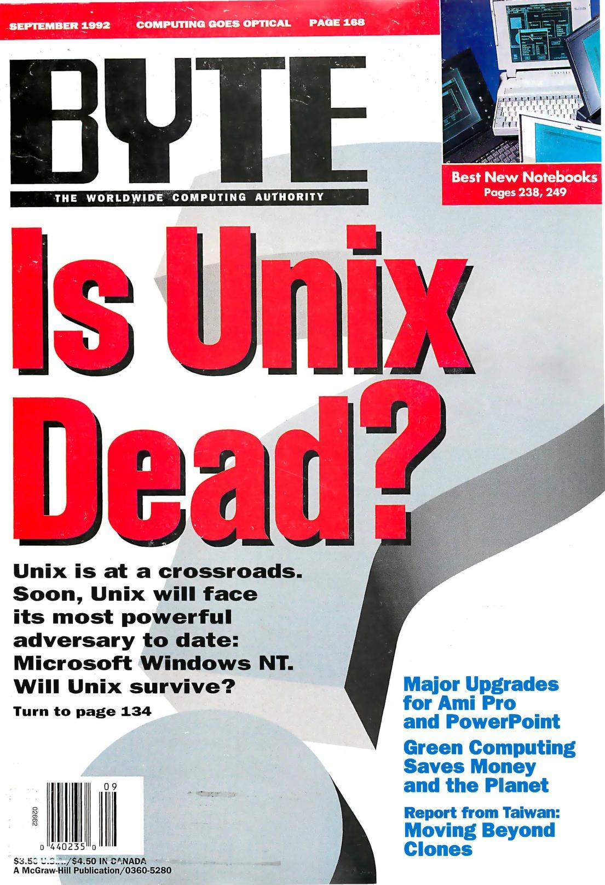

Windows NT (« New technology ») désigne la série de systèmes d'exploitation multitâche préemptif, multi-utilisateur, multiprocesseur, créés par Microsoft et ne reposant pas sur le système historique MS-DOS de Microsoft (contrairement à Windows 1.0, 2, 3.x, 95, 98 et Me). Il a permis à Microsoft et son partenaire Intel d'entrer sur le marché des serveurs.

La première version de Windows NT sort en 1993.

Windows NT deviendra ensuite Windows 2000 puis fusionnera avec les systèmes Windows historiques avec Windows XP et suivants.

---

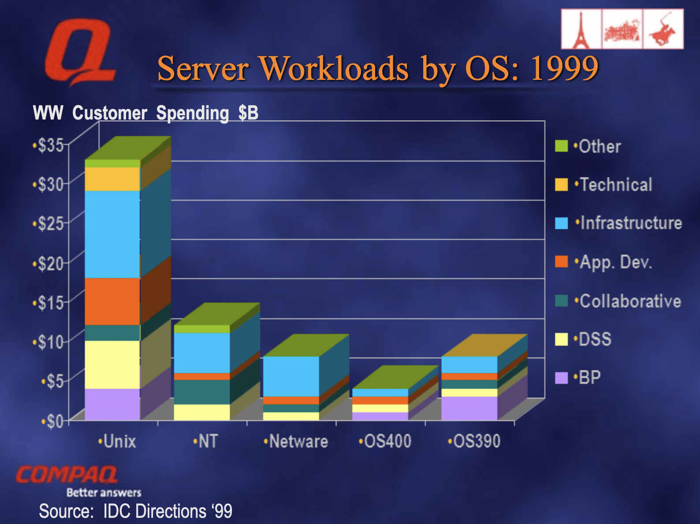

---

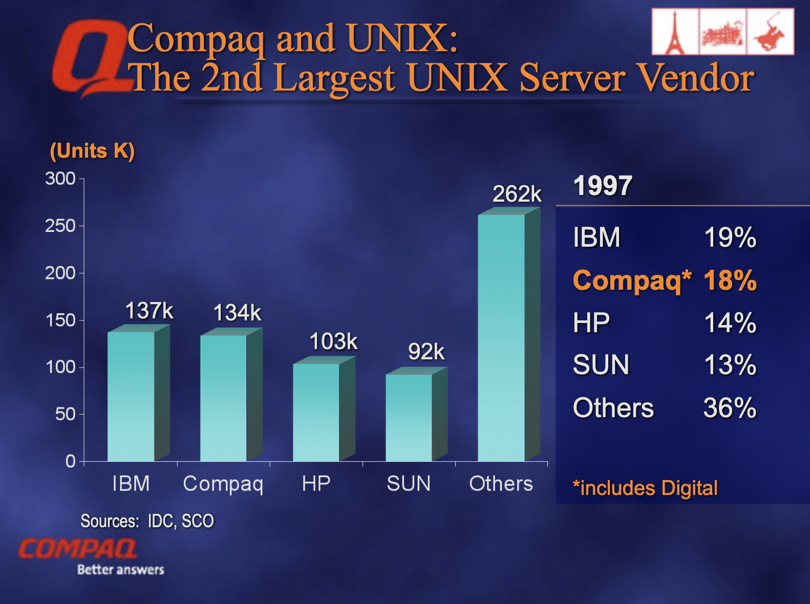

---


---

# Top 500 Supercomputers

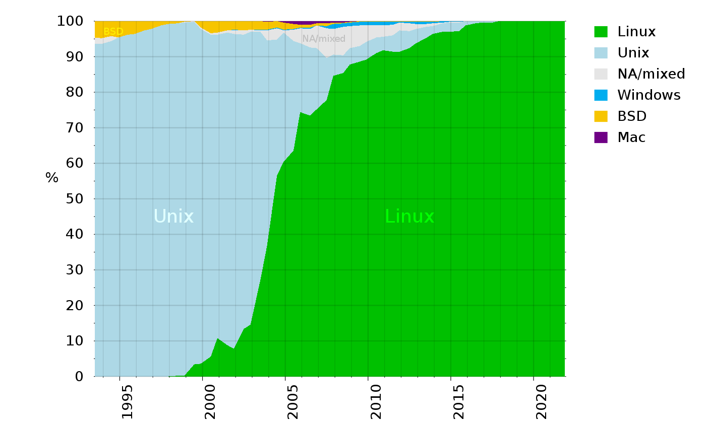

---

# Clients Web

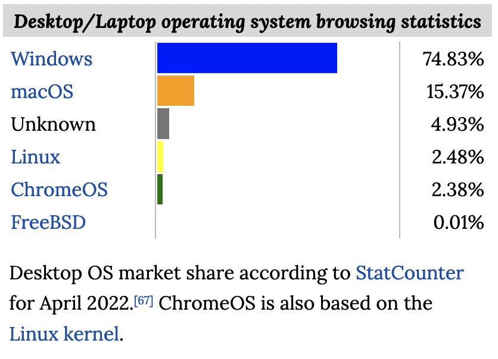 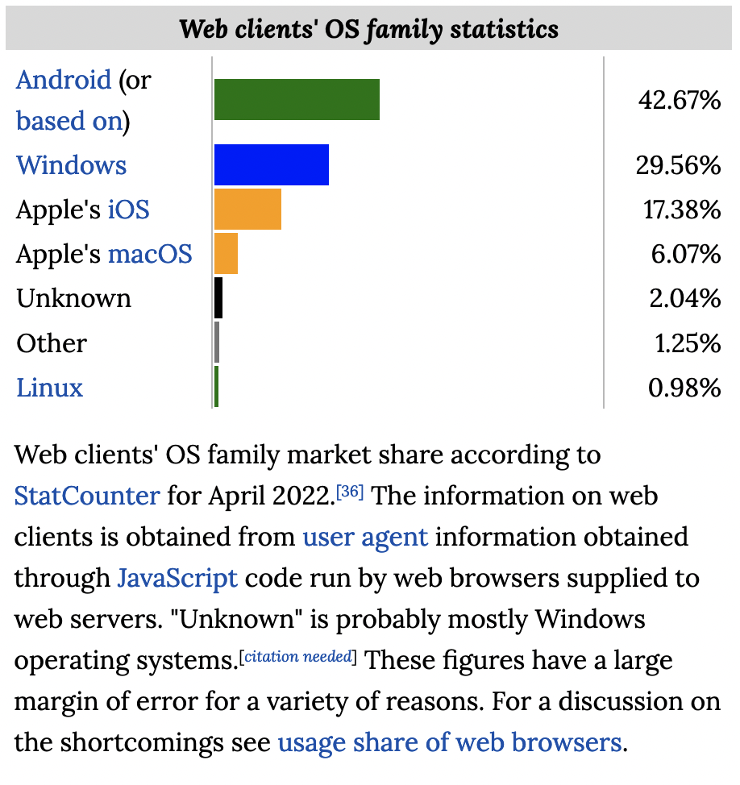

---

# Pour aller plus loin

- Peter Salus, "A quarter century of Unix" (1994)
- Rob Pike, "Unix History" (2018) <https://www.youtube.com/watch?v=_2NI6t2r_Hs>

---

# Interlude: la "philosophie Unix"

---

# Concepts clefs (70s)

1. Processus (et mémoire virtuelle)
2. Unification des périphériques/fichiers ("everything is a file")
3. Shell (et pipes)
4. Système de fichiers

= Concepts hérités de Multics (en grande partie), mais simplifiés. Multics cherchait à tout faire, à être trop polyvalent, trop flexible, et a échoué.
Vs. une des philosophies de base d'Unix était de "rester simple" ("KISS").

---

# Architecture d'origine (simplifiée)

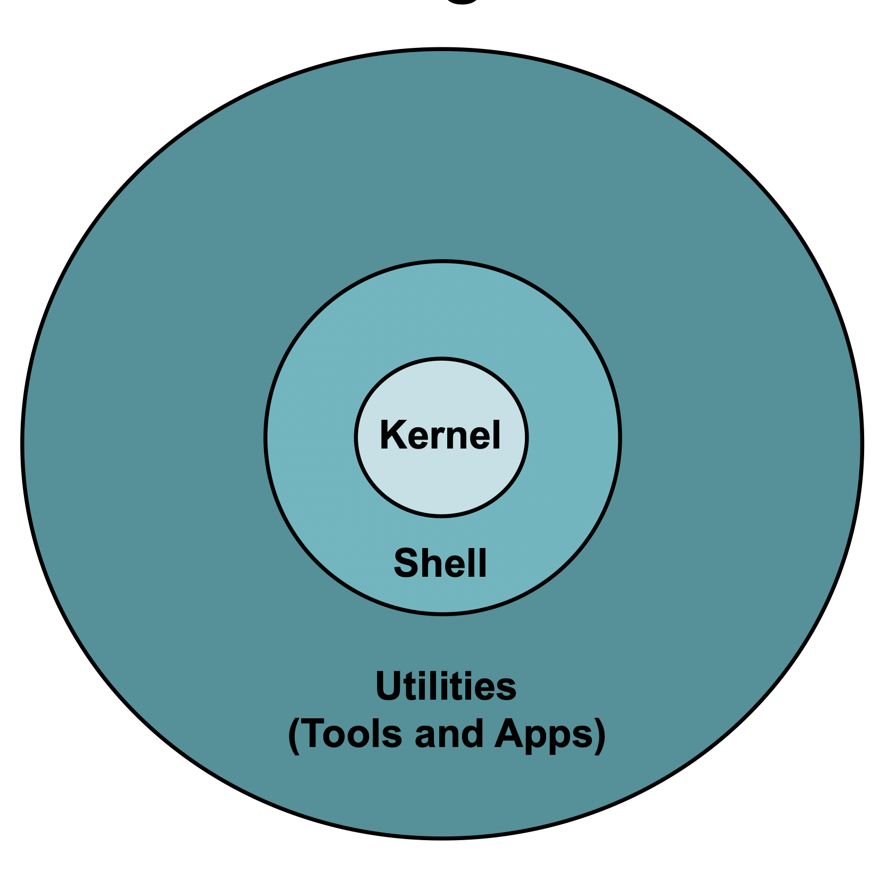

**Kernel** : Contrôle le système.
Tâches principales : gestion des processus / communication avec les périphériques / système de fichiers.

**Shell** : Interface utilisateur permettant de communiquer avec le système.
Comprend un ensemble d'utilitaires shell de base. Permet la création de scripts.

**Outils** : Le plus grand ensemble d'Unix.
Outils développés pour aider l'utilisateur dans ses tâches, par exemple: édition et traitement de texte, développement, communication (mail), etc .

---

# Architecture moderne (POSIX)

POSIX spécifie, dans dix-sept documents différents, les interfaces utilisateurs et les interfaces logicielles, la ligne de commande standard et l'interface de script qu'est le Bourne shell. Les autres commandes, services et utilitaires comprennent awk, echo, ed, et des centaines d'autres. Les services d'entrées/sorties de base (fichiers, terminaux, réseau) doivent être présents ; le système doit supporter certains attributs spécifiques pour les fichiers. POSIX définit aussi une interface de programmation standard, et celle-ci est prise en charge par la plupart des systèmes d'exploitation récents. 

---

# Outils de développement Unix

- Editeur: `ed`, `vi` (-> vim), Emacs (-> GNU Emacs)
- Compilateur(s): `cc`, autres
- `make`
- `diff` + `patch`
- Plus tard: GCC et outils associés, `m4`, Automake / Autoconf...

Lorsqu'un logiciel est diffusé sous forme de sources (et a été développé avec les outils GNU), l'installation se fait, souvent, par la séquence "`configure ; make ; make install`" ("CMMI")

---

# La culture Unix

- Unix a créé une culture
- Les gens voulaient un meilleur système informatique, plus efficace.
- Ces personnes étaient logiques et pragmatiques dans leur réflexion.
- Ils ont jeté les bases de : "La philosophie Unix"

---

# The invention of pipes (1973)

"And in their ensuing conversation, the historian establishes that this was the moment that truly gave birth to **the idea that Unix is a collection of tools**.

- Mahoney: Was the notion of toolbox there before pipes?
- McIlroy: No.
- Mahoney: Or did pipes create it?
- McIlroy: Pipes created it.
- Mahoney: Unix looked different after pipes?
- McIlroy: Yes, the philosophy that everybody started putting forth, “**This is the Unix philosophy. Write programs that do one thing and do it well. Write programs to work together. Write programs that handle text streams, because that is a universal interface**.” All of those ideas, which add up to the tool approach, might have been there in some unformed way prior to pipes, but they really they came in afterwards.""

---

# Doug McIlroy (1978)


- (i) Make each program do one thing well. To do a new job, build afresh rather than complicate old programs by adding new features.

- (ii) Expect the output of every program to become the input to another, as yet unknown, program. Don't clutter output with extraneous information. Avoid stringently columnar or binary input formats. Don't insist on interactive input.

- (iii) Design and build software, even operating systems, to be tried early, ideally within weeks. Don't hesitate to throw away the clumsy parts and rebuild them.

- (iv) Use tools in preference to unskilled help to lighten a programming task, even if you have to detour to build the tools and expect to throw some of them out after you've finished using them.

---

# Brian Kernighan

"Kernighan moved into his conclusion by asking what the technical legacy of Unix is. Some significant pieces of that legacy, including the hierarchical filesystem, use of high-level languages, and the programmable shell, have their origins in Multics. Others, including pipes, the whole tools concept, and regular expressions, are a direct result of the Unix work. And most importantly, he said, was that Unix brought a new philosophy on how to create software.

Almost all of this was in place by 1975 and, he said, it may well be true that there have been no great insights into operating-system design since. Certainly Unix has seen a lot of additions, including networking, multiprocessor support, graphical interfaces, Unicode, and more. But it's all built on the foundation created nearly 50 years ago."

---

# Cont.

"The creation of Unix was the result of an accidental combination of factors, starting with the juxtaposition of two exceptionally creative people "with good taste". Kernighan gave a lot of credit to "benign management" at Bell Labs that allowed this work to go forward, naming Doug McIlroy in particular. It was also spurred by the arrival of cheap hardware (in which category he included the $50,000 PDP-11 used to develop the system early on). But a key part was the Bell Labs working environment, which included stable funding and a long-term view, which is something that is hard to find today. 

Source: <https://lwn.net/Articles/881431/>

---

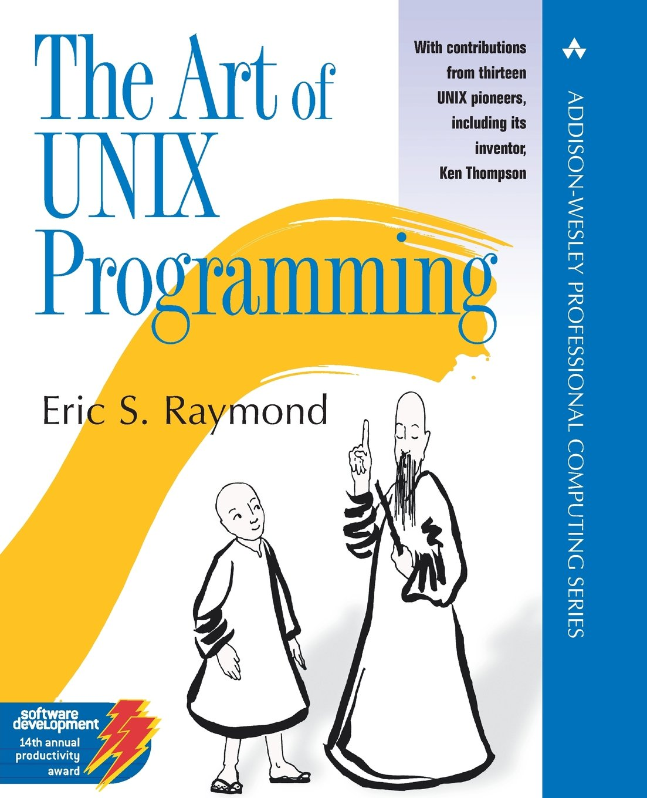

# Eric S. Raymond

- Rule of Modularity: Write simple parts connected by clean interfaces.
- Rule of Clarity: Clarity is better than cleverness.
- Rule of Composition: Design programs to be connected to other programs.
- Rule of Separation: Separate policy from mechanism; separate interfaces from engines.
- Rule of Simplicity: Design for simplicity; add complexity only where you must.
- Rule of Parsimony: Write a big program only when it is clear by demonstration that nothing else will do.
- Rule of Transparency: Design for visibility to make inspection and debugging easier.

----

# (cont.)

- Rule of Robustness: Robustness is the child of transparency and simplicity.
- Rule of Representation: Fold knowledge into data so program logic can be stupid and robust.
- Rule of Least Surprise: In interface design, always do the least surprising thing.
- Rule of Silence: When a program has nothing surprising to say, it should say nothing.
- Rule of Repair: When you must fail, fail noisily and as soon as possible.
- Rule of Economy: Programmer time is expensive; conserve it in preference to machine time.
- Rule of Generation: Avoid hand-hacking; write programs to write programs when you can.
- Rule of Optimization: Prototype before polishing. Get it working before you optimize it.
- Rule of Diversity: Distrust all claims for “one true way”.
- Rule of Extensibility: Design for the future, because it will be here sooner than you think.

---

# Rule of Modularity

Write simple parts connected by clean interfaces.
Software can be very complicated, especially for large systems.
Its even hard for the programming to cope with the complexity.
Take a modular approach and build many small, but simple components.
These components work together through simple and clean interfaces.

---

# Rule of Clarity

Clarity is better than cleverness.
Write code for humans to read, first!

---

# Rule of Composition

Design programs to be connected with other programs
THINK PIPE!
Stick with text streams for input and output.
Avoid the use of user input, use command line flags instead.
To make programs composable, make them independent. A program on one end of a text stream should care as little as possible about the program on the other end.

---

# Rule of Simplicity

Design for simplicity; add complexity only where you must.
The notion of “intricate and beautiful complexities” is almost an oxymoron.
Complexity leads to bugs.
Keep programs as simple as possible. Sometimes less is more.
“Worse” is “better”.
If other processing is required, consider writing another programming and exploiting composibility . . i.e. piping.

---

# Rule of Transparency

Design for visibility to make inspection and debugging easier.
Debugging dominates development. Unix is made to have programs work together.
Make it easy to understand how your program works (i.e. make it transparent).
For a program to demonstrate its own correctness, it needs to be using input and output formats sufficiently simple so that the proper relationship between valid input and correct output is easy to check.
A good ʻmanual pageʼ with examples also helps!

---

# Rule of Robustness

Robustness is the child of transparency and simplicity.
Program should work well. Minimize when it fails, and when it does fail, fail gracefully.
Consider situations, just as accepting empty lists/strings/etc., even in places where a human would seldom or never supply an empty string, avoids having to special-case such situations when generating the input mechanically.

---

# Rule of Least Surprise

In interface design, always do the least surprising thing.

The easiest programs to use are those that demand the least new learning from the user.
Stick with convention (+ means add).
Consider your audience.
Program used by sys administrators may have different common practices than a program used by programmers.
Avoid excessive features, novelty.

---

# Rule of Silence

When a program has nothing surprising to say, it should say nothing.

> "I think that the terseness of Unix programs is a central feature of the style. When your program's output becomes another's input, it should be easy to pick out the needed bits. And for people it is a human-factors necessity — important information should not be mixed in with verbosity about internal program behavior. If all displayed information is important, important information is easy to find."
-- Ken Arnold

---

# Rule of Repair
Repair what you can — but when you must fail, fail noisily and as soon as possible.

Basically, if it is something minor, fix it (or consider handling it), but if you “fail” then make sure you cause a detectable failure to the other programs.
Also, if possible, make it clear why it failed.

---

# Rule of Optimization
Prototype before polishing. Get it working before you optimize it.

“90% of the functionality delivered now is better than 100% of it delivered never!”
- Kernighan & Plauger ("The Elements of Programming Style", 1974)

“Premature optimization is the root of all evil”
– Donald Knuth (Computing “Grandfather”)

---

# discussion

- Qu'est-ce qui manque ?
- Les principes ci-dessus sont-ils universels ?
- Limitations de la "philosophie Unix" ?

---

# GUI

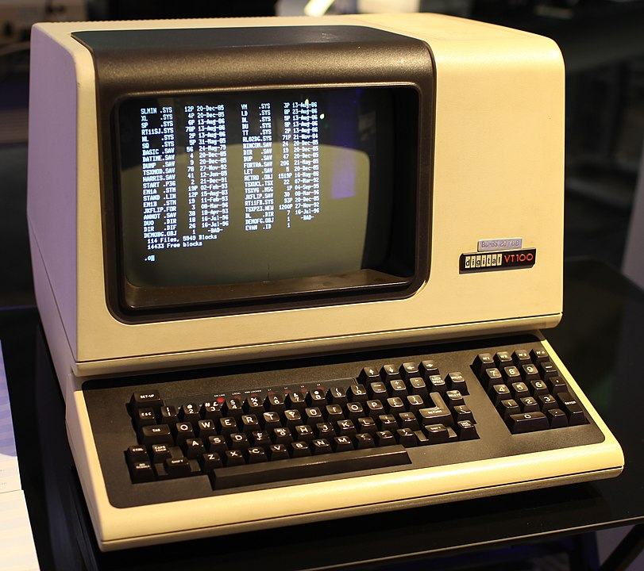 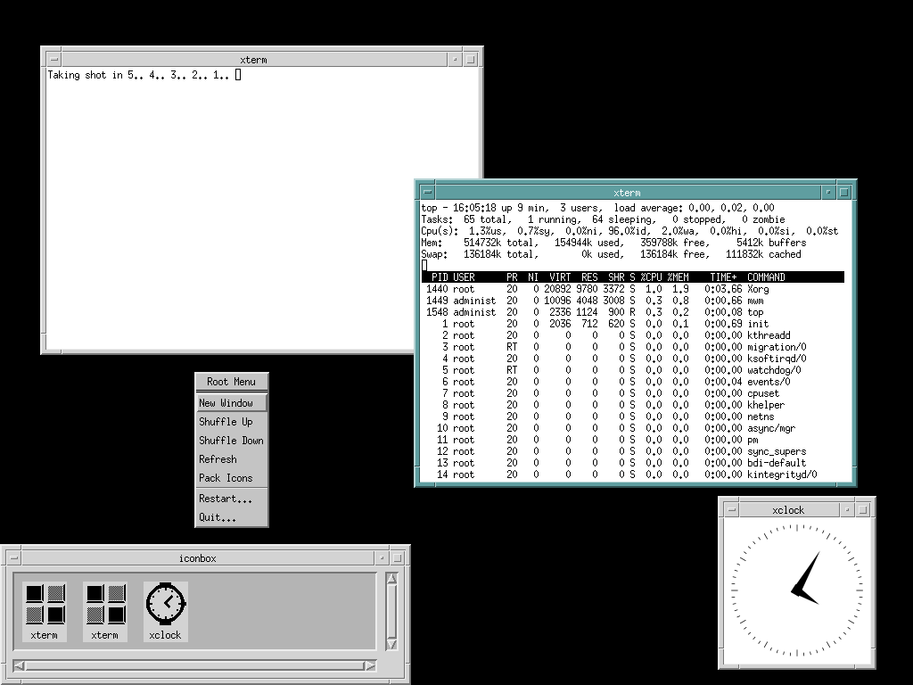

---

# Autres éléments de discussion

- Java - "Write once, run everywhere"
- Le Web
  - "Everything is a resource addressable by a URL"
  -  "[Netscape will soon reduce Windows to] a poorly debugged set of device drivers." (Marc Andreessen, 1995)
- Et plus généralement les systèmes distribués
- Les langages de script (Perl, Python...) comme alternative au Shell

Références:

- Rob Pike: The Good, the Bad, and the Ugly: The Unix Legacy (2001)
- Richard Gabriel: "Worse is better"
- ...

---

# Retour à la chronologie du libre

---

# Linus Benedict Torvalds

```
Newsgroups: comp.os.minix
From: torva...@klaava.Helsinki.FI (Linus Benedict Torvalds) Date: 25 Aug 91 20:57:08 GMT
Local: Sun 25 Aug 1991 21:57
Subject: What would you like to see most in minix?

Hello everybody out there using minix -

I’m doing a (free) operating system (just a hobby, won’t be big and professional like gnu) for
386(486) AT clones. This has been brewing since april, and is starting to get ready. I’d like any
feedback on things people like/dislike in minix, as my OS resembles it somewhat (same physical
layout of the file-system (due to practical reasons) among other things).

I’ve currently ported bash(1.08) and gcc(1.40), and things seem to work. This implies that I’ll get
something practical within a few months, and I’d like to know what features most people would want.
Any suggestions are welcome, but I won’t promise I’ll implement them :-)

Linus (torva...@kruuna.helsinki.fi)

PS. Yes - it’s free of any minix code, and it has a multi-threaded fs. It is NOT protable (uses 386
task switching etc), and it probably never will support anything other than AT-harddisks, as that’s
all I have :-(.
```

---


# RMS et l'imprimante Xerox 9700

---

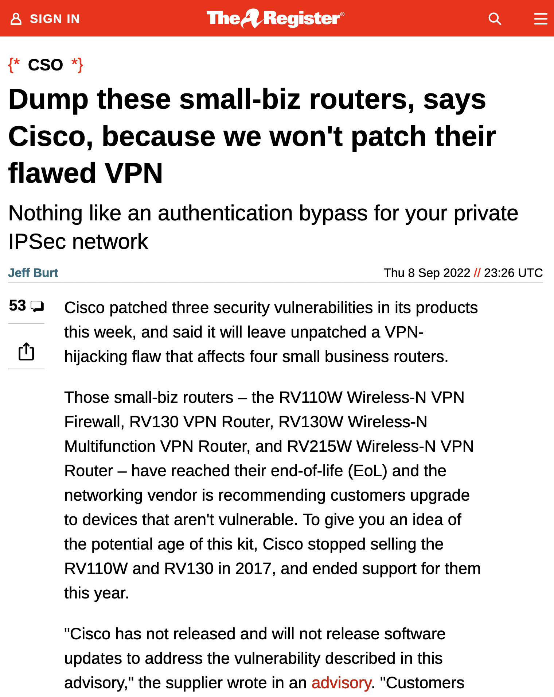

## Pourquoi est-ce plus que jamais d'actualité ? ->

---

# Les début de la FSF et du projet GNU

- 1971: RMS arrive au MIT (AI lab)
- 1980: le mythe fondateur de l'imprimante
- 1981: Symbolics embauche presque tous les hackers du MIT
- 1984: Stallman quitte le MIT pour diriger le projet GNU (www.gnu.org), annoncé en septembre 1983
- 1985: création de la [Free Software Foundation](https://www.fsf.org), publication du "[GNU Manifesto](http://www.gnu.org/gnu/manifesto.html)"
- 1989 : première version de la licence GPL (General Public Licence), avec l’aide de Eben Moeglen

---

# 1985 - X Window System

Aux environs de 1985, le “X Consortium”, basé au MIT, crée et distribue le “X Window System”.

```
From: rws@mit-bold (Robert W. Scheifler) To: window@athena
Subject: window system X
Date: 19 Jun 1984 0907-EDT (Tuesday)

I’ve spent the last couple weeks writing a window system for the VS100. I stole a fair amount of
code from W, surrounded it with an asynchronous rather than a synchronous interface, and called it
X. Overall performance appears to be about twice that of W. The code seems fairly solid at this
point, although there are still some deficiencies to be fixed up.

There is no documentation yet; anyone crazy enough to volunteer? I may get around to it eventually.

Anyone interested in seeing a demo can drop by NE43-531, although you may want to call 3-1945 first.
Anyone who wants the code can come by with a tape. Anyone interested in hacking deficiencies, feel
free to get in touch.
```

---

# Licence de X Window System

Il s’agit d’un “logiciel libre” avec une licence très permissive.

*The MIT License Copyright (c) . . .*

*Permission is hereby granted, free of charge, to any person obtaining a copy of this software and associated documentation files (the "Software"), to deal in the Software without restriction, including without limitation the rights to use, copy, modify, merge, publish, distribute, sublicense, and/or sell copies of the Software, and to permit persons to whom the Software is furnished to do so, subject to the following conditions:*

*The above copyright notice and this permission notice shall be included in all copies or substantial portions of the Software.*

---

# Toutes les pièces du puzzle sont en place

- GUI: X est disponible, entiérement libre
- Noyau: Linux est en plein dévéloppement
- OS: les outils *user space* GNU (compilateur, textutils) et BSD sont prêts
- Réseau: la pile TCP/IP est généralisée dans le réseau recherche, le débit monte
- Web: ftp est généralisé, WAIS montre des idées, WorldWideWeb.app existe
- Matériel: du matériel qui embarque le nécessaire pour des vrais OS se popularise (80386, 68030, processeurs RISC)
- Licences: la licence GPL commence à se repandre
- Manifesto: le GNU Manifesto fournit une première base philosophique pour le Logiciel Libre

---

# Quelques dates

1989: Cygnus, première entreprise qui offre du support pour GNU
1991: Linux 0.11: premiére version “autonome” (pour 386)
1992: 386BSD 0.1 par William et Lynne Jolitz
1992: US Air Force paye New York University (NYU) pour une suite Ada 95, sous licence GPL. NYU crée GNAT (GNU NYU Ada 95 Translator) avec GCC
1992: distributions Slackware (Patrick Volkerding), S.u.S.E. en Allemagne
1993: Ian Murdock crée Debian, et son “social contract”
1993: FreeBSD 1.0 pour 386
1994: Fondation de Ada Core Technologies (ACT), qui vit du support de GNAT, pas des licences
1994: Marc Ewing crée Red Hat

---

# Interlude: les distributions

- Une distribution Linux est un ensemble cohérent de logiciels, la plupart étant des logiciels libres, assemblés autour du noyau Linux, et formant un système d'exploitation pleinement opérationnel.
- Les plus populaires en 2022 semblent être: Debian, Ubuntu (dérivée de Debian), Linux Mint (idem), Fedora (base de Red Hat Enterprise Linux, et CentOS), Gentoo, OpenSUSE (base de SUSE Linux Enterprise), Alpine Linux (pour les containers)...

---

# Anatomie d'une distribution

Une distribution comprend *a minima*:

- Un installeur / configurateur
- Un système de paquets, incluant notamment des outils de build et d'installation
- Des milliers de paquets, dérivés (en général) de logiciels libres "upstream"
- Des processus de développement et de maintenance

---

# Quelques dates

1994: Linux Journal.
1994: NetBSD 1.0
1995: FreeBSD 2.0
1995: Première version (0.6.2) d’Apache distribuée.
1996: KDE est lancé (Matthias Ettrich)
1997: OpenBSD, fork de NetBSD par Theo de Raadt
1997: Eric S. Raymond : “The Cathedral and the Bazaar”
1997: GNOME est lancé (à cause des problèmes de la licence de Qt, base de KDE)

---

# 1998 - L'année où tout bascule

Jan. 1998: Netscape annonce le passage de Navigator en libre 
Fev. 1998: Peterson, Raymond, etc. créent le terme “open source”
Mar. 1998: Netscape ouvre le code
Mar. 1998: fondation de l'AFUL en France
Jul. 1998: Debian 2.0: 300 contributeurs, 1,500 paquets
Jul. 1998: KDE 1.0 sort
Jul. 1998: Linux Mandrake (Gael Duval)
Aou. 1998: Linus Torvalds fait la couverture de Forbes Magazine
Oct. 1998: IBM porte Apache sur les AS/400
Oct. 1998: Intel et Netscape investissent dans Red Hat
Nov. 1998: “Halloween” documents

---

# [fit] \(Interlude) Emergence de l'expression "open source"

---

# Contexte et motivations

L'expression « open source » est apparue en 1998, lors d'une réunion tenue à Palo Alto, en Californie, en réaction à l'annonce faite par Netscape en janvier 1998 de la publication du code source de Navigator.

Linus Torvalds a apporté son soutien le lendemain, et Phil Hughes a soutenu le terme dans le Linux Journal. Richard Stallman, le fondateur du mouvement du logiciel libre, semblait initialement adopter le terme, mais a ensuite changé d'avis.

Parmi les motivations: «free» possède deux significations en anglais, «libre» (au sens de «liberté») et «gratuit». Cette nouvelle désignation permet de rappeler aux utilisateurs qu'un logiciel a un coût. Il s'agit également de choisir un vocabulaire correspondant mieux au monde des affaires, le terme «free» (gratuit) de free software risquant d'inquiéter les entreprises.

---

# [fit]1997 Les principes du logiciel libre selon Debian (DFSG)

[.build-lists: false]

1. Redistribution libre et gratuite.
2. Code source.
3. Applications dérivées.
4. Intégrité du code source de l'auteur.
5. Aucune discrimination de personne ou de groupe.
6. Aucune discrimination de champ d'application.
7. Distribution de licence.
8. La licence ne doit pas être spécifique à Debian.
9. La licence ne doit pas contaminer d'autres logiciels.
10. Exemples de licence (-> GPL, MIT, Artistic)

Source: <https://www.debian.org/social_contract.fr.html>

---

# 1999 La définition de l'OSI

[.build-lists: false]

1. Redistribution libre
2. Code source
3. Travaux dérivés
4. Intégrité du code source de l'auteur
5. Pas de discrimination contre les personnes ou les groupes
6. Absence de discrimination dans les domaines de compétence
7. Distribution de la licence
8. La licence ne doit pas être spécifique à un produit
9. La licence ne doit pas restreindre d'autres logiciels
10. La licence doit être neutre sur le plan technologique

Source: <https://opensource.org/osd>

---

# Positionnement !=

> “Open source is a development method for software that harnesses the power of distributed peer review and transparency of process. The promise of open source is better quality, higher reliability, more flexibility, lower cost, and an end to predatory vendor lock-in.” -- OSI
<br>
> "Open source *is* free software. Open source started as a marketing program for free software back in 1998." -- Simon Phipps – President of OSI (2018)

---

# -> Les grandes controverses du libre

- "Free" vs. "Open Source"
- Idéologie vs. pragmatisme
- "Linux" vs. "GNU/Linux"
- GPL vs licences "permissives"
- Faut-il faire évoluer les définitions (FSF et OSI) pour prendre en compte certaines dimensions éthiques ? Pour éviter les abus des géants du cloud ?
- GNOME vs. KDE
- Le libre vs. le cloud
- Inclusivité des communautés
- ...

---

# Business timeline (des haut et des bas)

1999: fondation de MandrakeSoft, qui deviendra Mandriva en 2005 et fermera en 2015
1999: Marc Fleury démarre EJB-OSS, serveur J2EE qui deviendra JBoss
1999: IPO de Red Hat et de VA Linux
2000: IBM “investit” 1 Mrd de dollars dans Linux
2004: fondation de Canonical (Ubuntu)
2006: rachat de JBoss par Red Hat pour 350 M de $
2007: Java devient open source (*with strings attached*)
2008: rachat de MySQL par Sun pour 1 Mrd de $
2009: proche de la faillite, Sun Microsystems est racheté par Oracle
2017: rachat de GitHub par Microsoft pour 7 Mrd de $
2017: IPO de Mongodb (1.2 Mrds de $)
2019: rachat de Red Hat par IBM pour 34 Mrds de $
2021: IPO de Gitlab (15 Mrds de $ de capitalisation)

<!-- ---

# Virtualisation & Cloud

- 2001: Linux-VServer
- 2003: Xen, Qemu
- 2005: OpenVZ
- 2007: KVM
- 2010: OpenStack
- 2013: Docker -->

---

# Les textes fondateurs

(Attention: sélection personnelle)

- 1984: "Hackers: Heroes of the Computer Revolution" (S. Levy)
- 1997: "The Cathedral and the Bazaar" (E. S. Raymond)
- 1997: "Linux, mini OS contre maxi exploitation" (JC Guédon et B. Lang)
- 1998: "Piège dans le cyberespace" (R. Di Cosmo) et "Le Hold-Up planétaire" (R. Di Cosmo et D. Nora)
- 1999: "Open sources - voices of the open source revolution" (mutiples auteurs)

---

# Les grandes fondations

1985: FSF
1997: KDE e.V.
1999: Apache Foundation
2000: Linux Foundation (fusion de l'Open Source Development Labs du Free Standards Group)
2001: FSFE
2001: Python Software Foundation
2004: Eclipse Foundation
2007: OW2 (Fusion de ObjectWeb et OrientWare)
2010: Document Foundation (LibreOffice)

---

# Associations françaises

1996: APRIL
1998: AFUL
1998-1999: premiers LUGs (Parinux, GUILDE, ABUL...)
1998: Linuxfr
2001: Framasoft (2004 pour l'association)
2002: ADULLACT
2010: CNLL

---

# Manifestations notables

1998: "Linux Party" nationale
1999: Linux Expo Paris qui s'appelera ensuite Solutions Linux
2000: premières RMLL (Rencontres Mondiales du Logiciel Libre)
2001: OSDEM puis FOSDEM à Bruxelles
2008: Open World Forum / Forum Mondial du Libre
2015: OWF et Solution Linux fusionnent pour devenir le POSS (Paris Open Source Summit)
2021: le POSS devient l'OSXP (Open Source Experience)

---

# Langages de programmation "libres"

[.build-lists: false]

- 1987: Perl
- 1991: Python
- 1994: PHP
- 1995: Ruby
- 2009: Go
- 2010: Rust
- 2015: Zig

---

# Pop quizz

- Comment sont développés ces langages ?
- Qu'est-ce qui manque dans cette liste ? Pourquoi ? Est-ce justfié ?

---

# Aux plans législatif, réglementaire et parlementaire

- 1999: proposition de loi Laffite ("tendant à généraliser dans l'administration l'usage d'Internet et de logiciels libres")
- 2000: proposition de loi Le Déault, Paul, Cohen
- 2012: circulaire Ayrault
- 2013: loi ESR
- 2016: loi République Numérique
- 2020: rapport Bothorel puis circulaire Castex
- 2021: rapport Latombe

---

# Au plan judiciaire

- 2003-2010: affaire SCO v. Novell
- Depuis 2004: gpl-violations.org (Harald Welte)
- 2006: Gerby v. Darty, aka "Racketiciel", dénonciation de la vente liée [(site)](https://non.aux.racketiciels.info/)
- 2008: Free assigné en justice pour violation de la GPL, finit par publier ses patches en 2011.
- 2010: Oracle v. Google
- 2015: CNLL v. Ministère de l'Education Nationale ("Edunathon")

---

# Pop quiz

- Linux a-t-il "gagné" ?
  - Si oui, contre qui ? Et selon quels critères de "victoire" ?
  - Si oui, pourquoi ?
- L'open source a-t-il gagné ? Le libre ?
  - Même questions

---

# Open Hardware

---

# 2010 - RISC-V

RISC-V (« RISC five ») est une architecture de jeu d'instructions (*instruction set architecture* ou ISA) RISC ouverte et libre, disponible en versions 32, 64 et 128 bits. Ses spécifications sont ouvertes et peuvent être utilisées librement par l'enseignement, la recherche et l'industrie. Les specifications sont ratifiées de façon ouverte par la communauté internationale des développeurs.

Il en existe des implémentations libres (et d'autres non).

---

# 2011 - Open Compute Project (OCP)

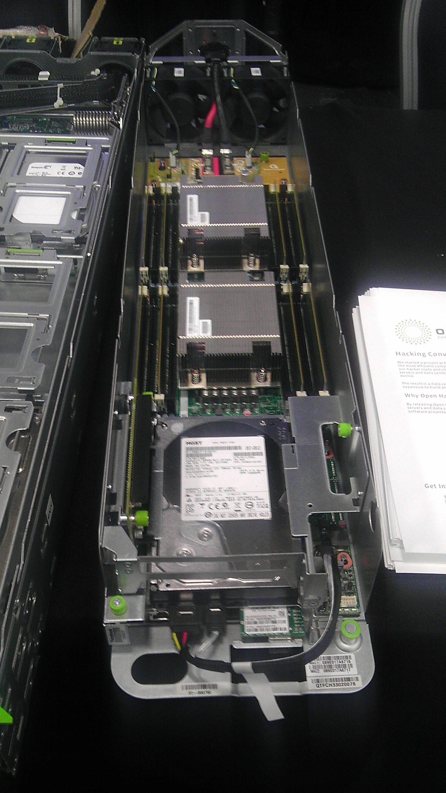

La fondation Open Compute Project (OCP) a été créée en 2011 avec pour mission d'appliquer les avantages de l'open source et de la collaboration ouverte au matériel et d'augmenter rapidement le rythme de l'innovation dans, près et autour des équipements de réseau des centres de données, des serveurs polyvalents et GPU, des dispositifs et appareils de stockage et des conceptions de rack évolutives. Le modèle de collaboration de l'OCP est appliqué au-delà du centre de données, contribuant à faire progresser l'industrie des télécommunications.

Les principales avancées concernent l'efficacité énergétique des systèmes déployés, mais aussi le développement de briques open source.

Facebook a par exemple annoncé avoir économisé 2 milliards de dollars sur ses coûts d'infrastructure en trois ans grâce à ce projet.

---

# "TD" - Lecture du *Debian Social Contract*

---

# Lecture du *Debian Social Contract*

Source: <https://www.debian.org/social_contract>

Grandes lignes:

1. Debian will remain 100% free
2. We will give back to the free software community
3. We will not hide problems
4. Our priorities are our users and free software
5. Works that do not meet our free software standards

---

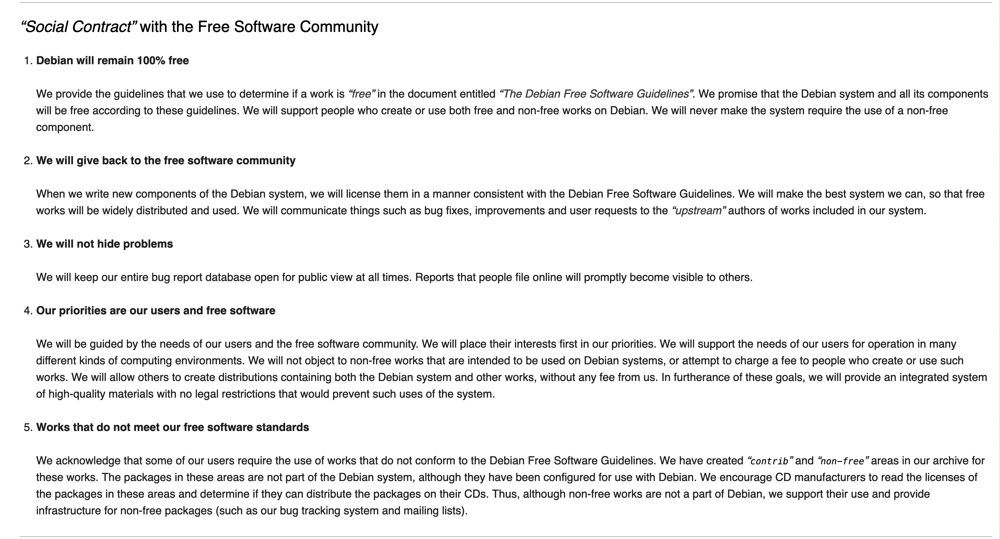

---

# Origine

```
To: debian-announce@lists.debian.org
Subject: Debian's "Social Contract" with the Free Software Community
From: bruce@debian.org (Bruce Perens)
Date: Fri, 4 Jul 97 22:32 PDT
Message-id: <[🔎] m0wkNSr-00IS1iC@debian.org>
Reply-to: Bruce Perens <bruce@debian.org>

[...]

The concept of a Linux distribution stating its "social contract with
the free software community" was suggested to me by Ean Schussler. I
composed a draft, and then it was refined by the Debian developers in
e-mail confernce during most of June. They then voted to approve it as
our publicly stated policy. We hope that other software projects,
including other Linux distributions, will use this document as a model.
We will gladly grant permission for any such use.
```

---

# Questions

- En quoi ces principes sont importants ? Quelles conséquences opérationnelles ?
- Sont-ils suffisants ?
- Ces principes sont-ils transposables à d'autres projets ? A une entreprise ?
- Pourquoi la FSF n'approuve pas ce texte ?

---

# Eléments de réponse

---

# Commentaires de la FSF

"Debian's Social Contract states the goal of making Debian entirely free software, and Debian conscientiously keeps nonfree software out of the official Debian system. However, Debian also maintains a repository of nonfree software. According to the project, this software is “not part of the Debian system,” but the repository is hosted on many of the project's main servers, and people can readily find these nonfree packages by browsing Debian's online package database and its wiki.

There is also a “contrib” repository; its packages are free, but some of them exist to load separately distributed proprietary programs. This too is not thoroughly separated from the main Debian distribution.

Debian is the only common non-endorsed distribution to keep nonfree blobs out of its main distribution. However, the problem partly remains. The nonfree firmware files live in Debian's nonfree repository, which is referenced in the documentation on debian.org, and the installer in some cases recommends them for the peripherals on the machine.

In addition, some of the free programs that are officially part of Debian invite the user to install some nonfree programs. Specifically, the Debian versions of Firefox and Chromium suggest nonfree plug-ins to install into them.

Debian's wiki also includes pages about installing nonfree firmware."

---

# Réaction de Bob Young

"The idea of the DSC was first proposed by Ean Schuessler after a conversation with Bob Young, co-founder of Red Hat. Schuessler said Red Hat should issue a set of guidelines that would guarantee to the community as the company expanded it would always be committed to the ideals of Free Software. Young said this would be a "kiss of death" for Red Hat, implying it would constrain the company's ability to generate profit. Concerned about Young's response, Schuessler and other Debian developers decided to broach the idea of a "social contract" that would supplement Debian's initial manifesto written by Ian Murdock."

---

# Commentaires de E. Gabriella Coleman (2005)

"Developers continually draw on these texts to craft a dense ethical practice that sustains itself primarily via ongoing acts of narrative interpretation."

"By “ethical enculturation,” I refer to a process of relatively conflict-free socialization. Among developers, this includes learning the tacit and explicit knowledge (such as technical, moral, or procedural knowledge) needed to effectively interact with other members of a project, as well as acquiring trust, learning appropriate social behavior, and establishing “best practices.”"

---

# Commentaires de E. Gabriella Coleman (2005)

"While not all developers are equally invested in the legal discussion of F/OSS, a basic understanding of normative IP law and F/OSS legal convention is required on a functional basis in order to participate in Debian."

"The third ethical moment I investigate is crisis. As the number of developers in the Debian project has grown from one dozen to nearly one thousand, punctuated crises routinely emerge around particularly contested issues. [...] Many of these crises have an acute phase in which debate erupts on several media all at once: mailing lists, IRC conversation, and blog entries. While the debate during these periods can be congenial, measured, rational, and sometimes peppered with jokes, its tone can also be passionate and uncharitable, sometimes downright vicious. During these moments, we find that while developers may share a common ethical ground, they often disagree about the implementation of its principles. "

---

# Crédits

- Photos: en général, viennent de Wikipedia.
- Captures d'écrans: viennent de leurs sites respectifs.
- Textes: originaux (copyright Stefane Fermigier, 2022 - licence: CC BY SA) ou dérivés de cours similaires publiés par les Pr. Di Cosmo, Riehle, Zacchiroli, sous licences permettant la réutilisation et/ou avec l'accord des intéressés.

- Slides disponibles ici: <https://github.com/sfermigier/mineure-oss-epita>
